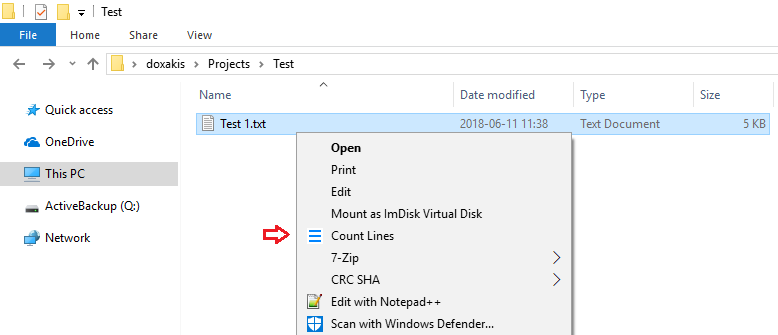

# Let's check out how we can create a Windows Shell Extension

I'm gonna use SharpShell, it makes it easy to create Windows Shell Extensions using the .NET Framework.

I'm following this tuto: https://www.codeproject.com/Articles/512956/NET-Shell-Extensions-Shell-Context-Menus

# Things to highlight

- We can choose the class of extension we want to support through the attribute: COMServerAssociation (e.g. `[COMServerAssociation(AssociationType.ClassOfExtension, ".txt")]` for text files) But, we can also target drives and folders.

- We can customize the displayed icon (a png image embedded in a resource file)

- We got the selected item paths and we can handle it in c#. (In this example, we count the lines)

# How to build and deploy it

- Build the solution (using Visual Studio 2017)
- For an installation not using the GAC, from the bin\Debug or bin\Release folder on the command line (with admin right):

Windows 64 bit:
`C:\Windows\Microsoft.NET\Framework64\v4.0.30319\RegAsm.exe /codebase CountLinesExtension.dll`

Windows 32 bit:
`C:\Windows\Microsoft.NET\Framework\v4.0.30319\RegAsm.exe /codebase CountLinesExtension.dll`

- Open the file explorer and right click on a text file:

    

# Uninstallation

Windows 64 bit:
`C:\Windows\Microsoft.NET\Framework64\v4.0.30319\RegAsm.exe /u CountLinesExtension.dll`

Windows 32 bit:
`C:\Windows\Microsoft.NET\Framework\v4.0.30319\RegAsm.exe /u CountLinesExtension.dll`

# FAQ

When having trouble building the solution because of files in use:

- uninstall the Windows Extension (`RegAsm /u CountLinesExtension.dll`)
- restart the Windows Explorer: `taskkill /f /im explorer.exe & explorer.exe`

# Copyright and license
Code released under the MIT license.